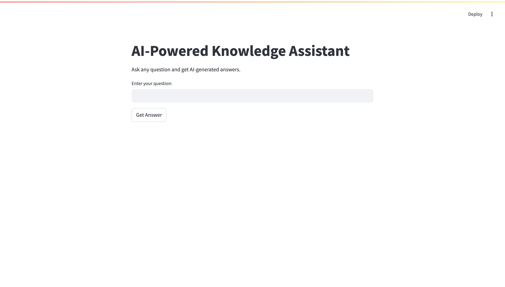

# AI-Powered Knowledge Assistant 🚀  

An AI-driven **knowledge retrieval and question-answering system** using **Hugging Face’s free API** to generate intelligent responses.

---

## 📸 User Interface Preview  
Below is how the AI-Powered Knowledge Assistant looks when running:



---

## 📌 Project Overview  
This project is a **chatbot-style assistant** that processes user queries and generates **AI-powered responses**. It utilizes:  
✅ **Hugging Face API** (free LLMs)  
✅ **Flask backend** (to handle API requests)  
✅ **Streamlit frontend** (for an interactive UI)  

💡 **Use Case Examples:**  
- General knowledge Q&A  
- Research assistance  
- Programming help  

---

## 📦 Technologies Used
| **Technology**  | **Purpose**  |
|-----------------|-------------|
| **Python**      | Backend & API calls |
| **Flask**       | API request handling |
| **Streamlit**   | User interface |
| **Hugging Face API** | Free LLM for text generation |
| **Git/GitHub**  | Version control |

---
## 🛠️ How It Works
1. User **enters a question** in the Streamlit UI.
2. The **frontend sends the request** to the Flask backend.
3. The backend **calls Hugging Face’s free API** to generate a response.
4. The **response is displayed** on the frontend.

---

## 🚀 Installation & Execution Steps
### 1️⃣ Prerequisites
Ensure the following are installed:
- **Python (3.8+)** → [Download Python](https://www.python.org/downloads/)
- **pip** (Python package manager)  
- **Virtual Environment (venv)**  

Check if Python is installed:
```bash
python3 --version
```
If missing, install it using **Homebrew**:
```bash
brew install python
```

---

### 2️⃣ Clone the Repository
```bash
git clone https://github.com/yourusername/AI_Powered_Knowledge_Assistant.git
cd AI_Powered_Knowledge_Assistant
```

---

### 3️⃣ Create and Activate a Virtual Environment
```bash
python3 -m venv venv
source venv/bin/activate  # Mac/Linux
venv\\Scripts\\activate   # Windows
```

---

### 4️⃣ Install Dependencies
```bash
pip install -r requirements.txt
```
(If `requirements.txt` doesn’t exist, install manually:)
```bash
pip install flask streamlit requests
```

---

### 5️⃣ Get a Hugging Face API Key
1. Sign up at **[Hugging Face](https://huggingface.co/)**  
2. Go to **[Access Tokens](https://huggingface.co/settings/tokens)**  
3. Generate a new **API key** (set to **Read** access)

---

### 6️⃣ Set Your API Key (Environment Variable)
To keep the API key **secure**, set it as an **environment variable**.
**On Mac/Linux:**
```bash
export HUGGINGFACE_API_KEY="your_api_key_here"
```

**On Windows (PowerShell):**
```powershell
$env:HUGGINGFACE_API_KEY="your_api_key_here"
```

---

## 🖥️ Backend Code (`chatbot_backend.py`)
```python
import requests
import os
from flask import Flask, request, jsonify

app = Flask(__name__)

HUGGINGFACE_API_KEY = os.getenv("HUGGINGFACE_API_KEY")
API_URL = "https://api-inference.huggingface.co/models/mistralai/Mistral-7B-Instruct"

@app.route("/chat", methods=["POST"])
def chat():
    data = request.get_json()
    question = data.get("question")
    if not question:
        return jsonify({"error": "No question provided"}), 400
    headers = {"Authorization": f"Bearer {HUGGINGFACE_API_KEY}"}
    payload = {"inputs": question}
    response = requests.post(API_URL, json=payload, headers=headers)
    if response.status_code == 200:
        answer = response.json()[0].get("generated_text", "No response received.")
        return jsonify({"answer": answer})
    else:
        return jsonify({"error": f"Failed to fetch response: {response.text}"}), 500

if __name__ == "__main__":
    app.run(port=5000, debug=True)
```

---

## 🎨 Frontend Code (`chatbot_frontend.py`)
```python
import streamlit as st
import requests

st.title("AI-Powered Knowledge Assistant")

st.write("Ask any question and get AI-generated answers.")

question = st.text_input("Enter your question:")

if st.button("Get Answer"):
    if question:
        response = requests.post("http://localhost:5000/chat", json={"question": question})
        if response.status_code == 200:
            answer = response.json().get("answer", "No response received.")
            st.write(f"**Answer:** {answer}")
        else:
            st.error("Error fetching response from backend.")
    else:
        st.warning("Please enter a question.")
```

---

### 7️⃣ Run the Backend
```bash
python chatbot_backend.py
```
✔️ This starts the API at **`http://localhost:5000`**.

---

### 8️⃣ Run the Frontend
```bash
streamlit run chatbot_frontend.py
```
✔️ This launches the UI at **`http://localhost:8501`**.

---

## 📸 User Interface Preview  


---

## 🛠️ Troubleshooting
### ❌ Issue: "Error fetching response from backend"
- **Check if backend is running** → Run `python chatbot_backend.py`
- **Ensure frontend connects to `http://localhost:5000/chat`**
- **Check API key** → Ensure `HUGGINGFACE_API_KEY` is set correctly.

### ❌ Issue: "Invalid API Key"
- **Regenerate a key** from [Hugging Face Settings](https://huggingface.co/settings/tokens)
- **Restart backend after updating the key**.

---

## 🔄 Future Enhancements
✔️ **Enhance Response Accuracy** with **Retrieval-Augmented Generation (RAG)**  
✔️ **Support Multi-Modal Inputs** (text, images, etc.)  
✔️ **Deploy to Cloud** (AWS, Google Cloud, etc.)  

---


## 🚀 Now You Can Upload to GitHub
### 1️⃣ Add Files
```bash
git init
git add .
git commit -m "Initial commit"
```

### 2️⃣ Push to GitHub
```bash
git remote add origin https://github.com/yourusername/AI_Powered_Knowledge_Assistant.git
git branch -M main
git push -u origin main
```

---